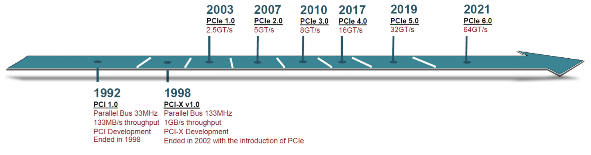
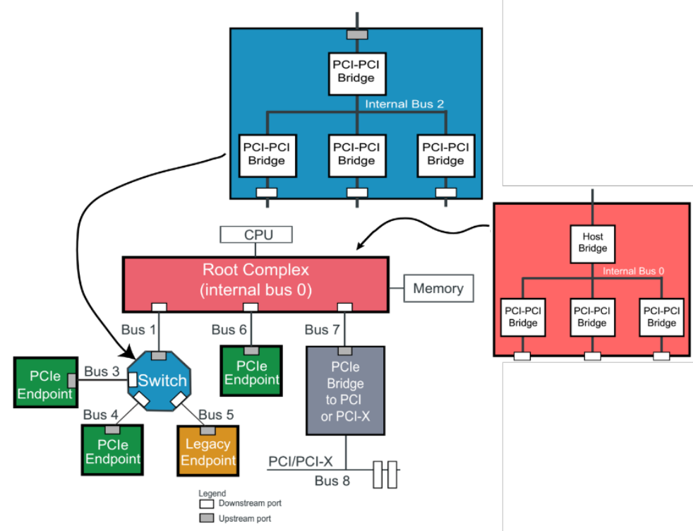
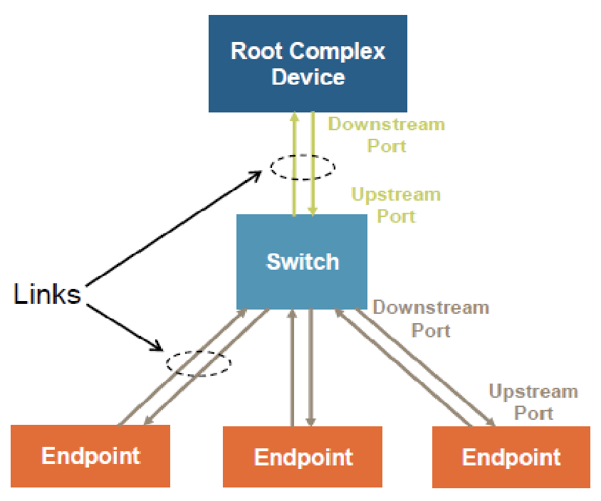
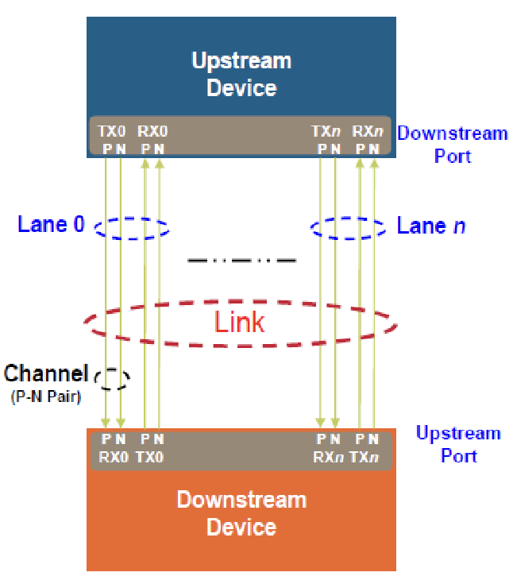
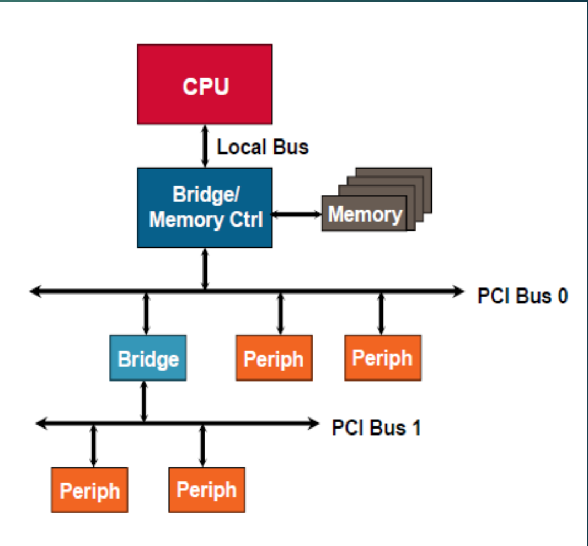

= Getting Started with PCIe (A Practical Beginner’s Guide)

Hello! I’m writing this post to share the PCIe lessons I’ve picked up while working on real-world PCIe
projects—things like chasing down LTSSM issues and building NIC drivers. I hope this guide helps you
understand the basics of PCIe and get started with your own PCIe projects.

In this series, I aim to:

.Do
* Focus on software-side fundamentals to build a solid mental model for modern systems.
* Provide practical examples of investigating PCIe hierarchies.
* Keep it simple and easy to understand. Prioritize conceptual clarity over specification-perfect details
to avoid unnecessary complexity.

Grab a cup of coffee icon:coffee[], and let's get started!

== What is PCIe?

* PCIe stands for Peripheral Component Interconnect Express.
* It is a motherboard expansion bus standard introduced in 2003 to enable high-speed serial communication
between the CPU and its peripheral components.




=== PCIe: Point-to-Point and Switched Architecture

PCIe replaces the shared bus with dedicated point-to-point links:

* Each device connects through its own PCIe link
* Links terminate at a Root Complex or a PCIe switch
* Communication is packet-based
* Multiple devices can transmit simultaneously without contention


PCIe bus device components:

* Root Complex (RC):
** A Root Complex denotes the device that connecte cpu and memory subsystem to PCI Express fabric. It may support
multiple Root ports. Root complex in this example supports 3 Root ports. Each root port is connected to an endpoint device or switch which form a PCIe hierarchy.
* PCIe Switch
* Endpoint(EP)





PCIe components connect via **Links** made of one or more **Lanes**, where each lane provides a full-duplex serial **Channel** between two **Ports**.

* **Link**: Collection of two ports and their interconnecting lanes.
* **Lane**: A set of differential signal pairs: one pair for Tx and another for Rx.
* **Port**:
** **Physically**: A group of transmitters and receivers located on the same chip that define a link.
** **Logically**: An interface between a component and a PCI Express Link.
* **x1, x2, x4, x8, x16, ..., xN (Link)**: A by-N link is composed of N lanes.




=== PCI Express PHY Layer

so when we are taking about PCIe we should also take about PCI bus device components:

* Host bridge
* PCI bridge
* PCI device

=== Packet-Based Communication

Data in PCIe is transmitted as packets called *Transaction Layer Packets (TLPs)*.

* TLPs include routing information
* PCIe switches inspect packet headers
* Packets are forwarded to the correct output port
* Traffic traverses multiple point-to-point links if necessary

=== What changed from PCI to PCIe?

The biggest shift from legacy PCI to PCIe was how devices are connected and communicate.

* Legacy PCI used a shared bus.
* PCIe uses point-to-point links.

=== Legacy PCI: Shared Bus Model

In legacy PCI systems:

* All devices shared the same physical bus.
* Only one device could communicate at a time.
* Devices competed for bus ownership.
* Performance degraded as more devices were added.




[NOTE]
--
we will be using qemu extensively to explore the PCIe hierarchy. so lets understand how pcie topology is created in qemu.
--

== PCIe using QEMU

Keep in mind:

* QEMU does not have a clear socket-device matching mechanism and allows any PCI/PCI Express device to be plugged into any PCI/PCI Express slot.
* Avoid mixing hierarchies:
** PCI devices in PCIe slots may fail.
** PCIe devices in PCI slots lose access to the Extended Configuration Space.
* **Best Practice:** Connect PCIe devices only to PCIe Root Ports or Downstream Ports.

=== Root Bus (pcie.0)

Place only the following kinds of devices directly on the Root Complex:

    (1) PCI Devices (e.g. network card, graphics card, IDE controller),
        not controllers. Place only legacy PCI devices on
        the Root Complex. These will be considered Integrated Endpoints.
        Note: Integrated Endpoints are not hot-pluggable.

        Although the PCI Express spec does not forbid PCI Express devices as
        Integrated Endpoints, existing hardware mostly integrates legacy PCI
        devices with the Root Complex. Guest OSes are suspected to behave
        strangely when PCI Express devices are integrated
        with the Root Complex.

    (2) PCI Express Root Ports (pcie-root-port), for starting exclusively
        PCI Express hierarchies.

    (3) PCI Express to PCI Bridge (pcie-pci-bridge), for starting legacy PCI
        hierarchies.

    (4) Extra Root Complexes (pxb-pcie), if multiple PCI Express Root Buses
        are needed.

```bash
   pcie.0 bus
   ----------------------------------------------------------------------------
        |                |                    |                  |
   -----------   ------------------   -------------------   --------------
   | PCI Dev |   | PCIe Root Port |   | PCIe-PCI Bridge |   |  pxb-pcie  |
   -----------   ------------------   -------------------   --------------
```

* Connect `minimal-pcie-nic` to `pcie-root-port`. Create root port at address `06.0` name it `rp2`.
Use rp2 to connect the `minimal-pcie-nic`.

```bash
runqemu playground-arm64 nographic slirp \
        qemuparams="-m 512 \
        -machine virt \
        -device pcie-root-port,id=rp2,bus=pcie.0,chassis=2,addr=06.0 \
        -device minimal-pcie-nic,bus=rp2"
```

```bash
root@playground-arm64:~# lspci -tv
-[0000:00]-+-00.0  Red Hat, Inc. QEMU PCIe Host bridge
           +-01.0  Red Hat, Inc. Virtio network device
           +-02.0  Red Hat, Inc. Virtio RNG
           +-03.0  Red Hat, Inc. Virtio block device
           +-04.0  Red Hat, Inc. QEMU XHCI Host Controller
           +-05.0  Red Hat, Inc. Virtio 1.0 GPU
           \-06.0-[01]----00.0  Red Hat, Inc. Device 10f1

# visual representation of the PCIe hierarchy
Bus 00
 ├─ 00.0 Host Bridge
 ├─ 01.0 Virtio net
 ├─ 02.0 Virtio RNG
 ├─ 03.0 Virtio block
 ├─ 04.0 XHCI
 ├─ 05.0 Virtio GPU
 └─ 06.0 Root Port
       └─ Bus 01
           └─ 00.0 Device 10f1
```
    
* `TBD`

== Let’s Grab another Coffee and Explore the PCIe Hierarchy

* `TBD`

== References

* https://www.ti.com/lit/an/snla415/snla415.pdf?ts=1767492313842
* https://blogs.oracle.com/linux/a-study-of-the-linux-kernel-pci-subsystem-with-qemu
* https://github.com/qemu/qemu/blob/master/docs/pcie.txt