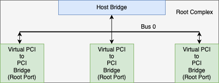
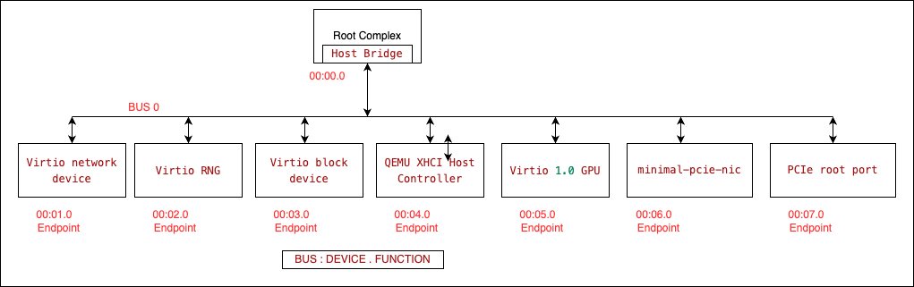
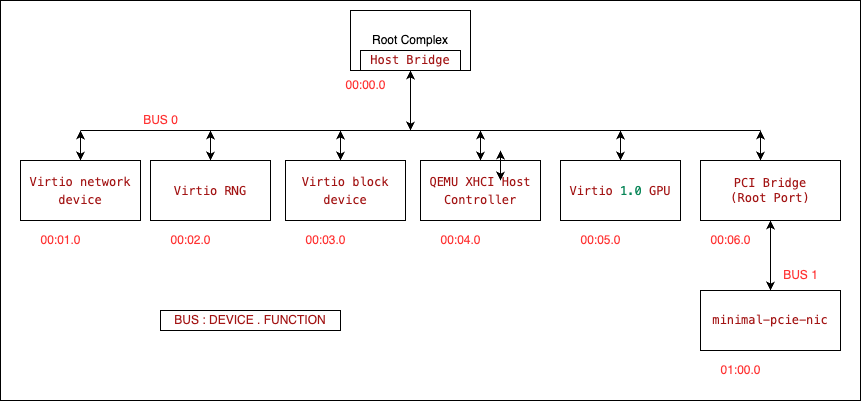
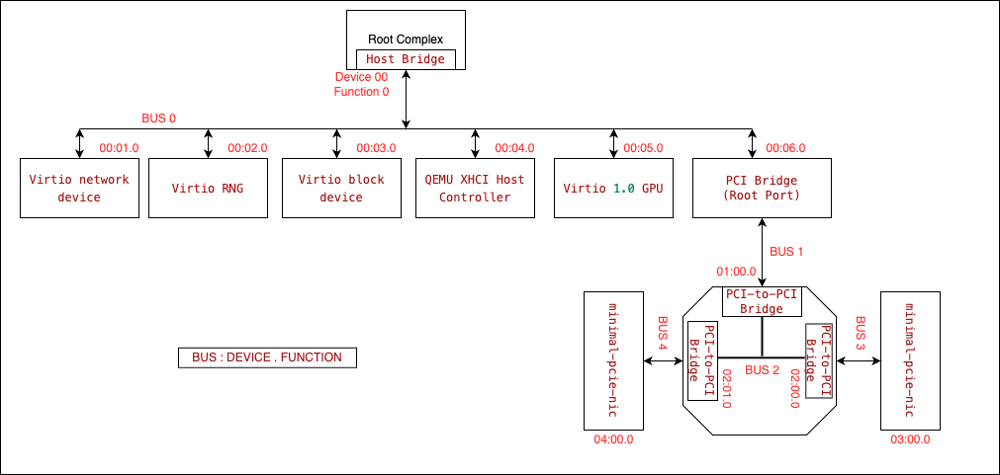

:icons: font

= Getting Started with PCIe (A Practical Beginner’s Guide)

Hello! I’m writing this post to share the PCIe details I’ve picked up while working on real-world PCIe
projects—things like chasing down LTSSM issues and writing NIC drivers. I hope this guide helps you
understand the basics of PCIe and get started with your own PCIe projects.

In this series, I aim to:

.Do
* Focus on software-side fundamentals to build a solid mental PCIe model.
* Provide practical examples of investigating PCIe hierarchies.
* Keep it simple and easy to understand. Prioritize conceptual clarity over specification-perfect details
to avoid unnecessary complexity.

Grab a cup of coffee icon:coffee[], and let's get started!

== So, What Exactly is PCIe?

`PCIe` stands for `Peripheral Component Interconnect Express`. `PCIe` was brought to replace `PCI` with followig improvements. `PCIe` uses serial bus technologies where as `PCI` is parallel bus so `PCIe` uses less IO pins which reduces the layout complexity thus reduce the board design cost.

image::../images/Timeline of PCIe Interface.png[] 

* `PCIe` allows to increase the transmission frequency.

----
Gen1= data rate 2.5Gbps
Gen2 = data rate 5Gbps
Gen3 = data rate 8Gbps
----

=== PCIe Topology

This is how cpu rootcomplex and endpoint devices are communicate with each other.

* CPU will access the Root Complex to configure the Root complex IP.
* Endpoint device will be accessed by CPU via Root Complex.
* CPU receives the interrupts of all the endpoint devices via Root Complex, Interrupt section is covered later in the document
* Root Complex can also access the memory without use CPU like DMA.
* End point can access the Host memory directly using Root Complex. To access the memory host system makes end device bus master to give the permission to the endpoint device.
* PCIe uses point to point topology which means single serial link connect to PCIe device.
* Each bus also assigned with the bus number during the software configuration which help the ECAM to generate the bus address.
* These bus numbers are used by switches or bridges etc to do the packet transection.
* PCIe has its own address space, which can be 32-bit or 64-bit depending on the root complex.

[NOTE]
--
PCI address space is visible to the PCIe components like Root complex, endpoints, Switches and bridges etc.
--

=== PCIe Components

As you can see in the picture available `root ports` are nothing but `virtual PCI to PCI bridges`. These bridges will be connected to bus 0 and these bridges will also create new busses to which other PCIe devices are connected.

image::images/PCIe Overview.png[width=70%]

Given picture shows 3 root ports:

1. `Root Port 1` is connected to `PCIe to PCI-X bridge`.
2. `Root Port 2` is connected to `PCIe switch`.
3. `Root Port 3` is connected to `PCIe express endpoint`.




[cols="1,3", options="header"]
|===
| Component | Description

| Root Complex
| The `Root Complex` is the PCIe controller present in the SoC. It connects the CPU and memory subsystem to the PCI Express fabric and manages communication with PCIe endpoint devices. It may support multiple Root Ports. In this example, the Root Complex supports **3 Root Ports**, each connecting to an endpoint device or a PCIe switch, forming a PCIe hierarchy.

| Host Bridge
| The `Host Bridge` connects the CPU to the PCI Express fabric. It acts as the interface between the processor and the PCIe subsystem.

| Root Port
| `Root ports` are nothing but `virtual PCI to PCI bridges`. A `Root Port` is a port on the Root Complex to which a PCIe Endpoint (a physical device such as NVMe or NIC) or a PCIe Switch (used to fan out multiple devices) can be connected.
Each Root Complex has a fixed number of Root Ports, which connect the CPU to different parts of the PCIe system.

| PCI-to-PCI Bridge
| `PCI-to-PCI Bridge` is used to create secondary PCI buses. The secondary bus is typically created via a `pci-bridge`.

|===

image::images/PCIe Switch.png[width=50%]

[cols="1,3", options="header"]
|===
| Component | Description

| PCI Express Switch
| `PCI Express Switch` is a device that routes packets to multiple ports and therefore multiple Endpoints at once.

| Endpoint(EP)
| `Endpoint(EP)` is a device that can be connected to a Root Port or Switch Port.

|===

=== PCI Express PHY Layer

image::../images/PCIe Overview 1.png[width=50%]

PCIe components connect via **Links** made of one or more **Lanes**, where each lane provides a full-duplex serial **Channel** between two **Ports**.

* **Link**: Collection of two ports and their interconnecting lanes.
* **Lane**: A set of differential signal pairs: one pair for Tx and another for Rx.
* **Port**:
** **Physically**: A group of transmitters and receivers located on the same chip that define a link.
** **Logically**: An interface between a component and a PCI Express Link.
* **x1, x2, x4, x8, x16, ..., xN (Link)**: A by-N link is composed of N lanes.

image::images/PCIe Overview 2.png[width=50%]

=== What changed from PCI to PCIe?

The biggest shift from legacy PCI to PCIe was how devices are connected and communicate.

* Legacy PCI used a shared bus.
* PCIe uses point-to-point links.

== Taking a Peek Inside Legacy PCI

In legacy PCI systems:

* All devices shared the same physical bus.
* Only one device could communicate at a time.
* Devices competed for bus ownership.
* Performance degraded as more devices were added.

image::../images/Legacy PCI Overview.png[width=50%]

=== PCI Components

so when we are taking about PCIe we should also take about PCI bus device components:

* Host bridge
* PCI bridge
* PCI device


**we will be using qemu extensively to explore the PCIe hierarchy. so lets understand how pcie topology is created in qemu.**


== Let’s Grab another Coffee icon:coffee[] and Explore the PCIe Hierarchy using lspci output

Major change in PCIe from legacy PCI is the change from a true bus topology to a point-to-point link. We can take an example of network device to understand this(change from Hub to Switch). Each link is a  point to point link that is routed just like an Ethernet cord on a packet-switched Ethernet network. Instead of L3 packets, PCIe uses TLPs (Transaction Layer Protocol) to transfer data.
That means PCIe is not a bus protocol. here `bus` means multiple devices are talking on the same physical link. TLP packet are routed over the toplogy to find out the correct destination. we will uderstand this in details in next sections.

```bash
root@playground-arm64:~# lspci -tv
-[0000:00]-+-00.0  Red Hat, Inc. QEMU PCIe Host bridge
           +-01.0  Red Hat, Inc. Virtio network device
           +-02.0  Red Hat, Inc. Virtio RNG
           +-03.0  Red Hat, Inc. Virtio block device
           +-04.0  Red Hat, Inc. QEMU XHCI Host Controller
           \-05.0  Red Hat, Inc. Device 10f1
```

* Each device connects through its own PCIe link.
* Links terminate at a Root Complex or a PCIe switch.
* Communication is packet-based.
* Multiple devices can transmit simultaneously without contention.

PCI devices are identified by a **Bus/Device/Function (BDF)** address. Busses are numbered 0–255, while Device and Function IDs specify the exact component.



In the illustration above, we can see multiple `PCIe/PCI devices` and `root port` connected to the `Root Complex`. There can be mutiple `Root ports` which are physically supported by the `Root Complex`. 

This output illustrates the PCIe topology of the QEMU machine. The `QEMU PCIe Host bridge` (at `00.0`) represents the Root Complex, which is logically integrated into the CPU silicon and serves as the host interface for all PCIe communication. In the following sections, we will explore how to expand this topology by adding new devices.

Some root ports are connected to `PCIe switch` and some are connected to `PCIe endpoint` directly. We will cover this in **Exploring PCIe with QEMU**.

Bus 0 is physically integrated into the CPU silicon. Devices connected to this bus reside within the processor package and communicate via proprietary, high-speed internal interconnects. While these interconnects use vendor-specific protocols, they are logically presented to the system using the PCIe protocol. These specialized devices are known as **Root Complex Integrated Endpoints (RCIE)** because they are integrated directly into the Root Complex.

Below output is from the QEMU bu tit still shows the **Root Complex Integrated Endpoints (RCIE)**

```bash
00:04.0 USB controller: Red Hat, Inc. QEMU XHCI Host Controller (rev 01) (prog-if 30 [XHCI])
        Subsystem: Red Hat, Inc. Device 1100
        Control: I/O- Mem+ BusMaster+ SpecCycle- MemWINV- VGASnoop- ParErr- Stepping- SERR- FastB2B- DisINTx+
        Status: Cap+ 66MHz- UDF- FastB2B- ParErr- DEVSEL=fast >TAbort- <TAbort- <MAbort- >SERR- <PERR- INTx-
        Latency: 0, Cache Line Size: 64 bytes
        Interrupt: pin A routed to IRQ 29
        Region 0: Memory at 800000c000 (64-bit, non-prefetchable) [size=16K]
        Capabilities: [90] MSI-X: Enable+ Count=16 Masked-
                Vector table: BAR=0 offset=00003000
                PBA: BAR=0 offset=00003800
        Capabilities: [a0] Express (v2) Root Complex Integrated Endpoint, IntMsgNum 0. <<<<<< RCIE
                DevCap: MaxPayload 128 bytes, PhantFunc 0
                        ExtTag+ RBE+ FLReset- TEE-IO-
                DevCtl: CorrErr- NonFatalErr- FatalErr- UnsupReq-
                        RlxdOrd- ExtTag- PhantFunc- AuxPwr- NoSnoop-
                        MaxPayload 128 bytes, MaxReadReq 128 bytes
                DevSta: CorrErr- NonFatalErr- FatalErr- UnsupReq- AuxPwr- TransPend-
                DevCap2: Completion Timeout: Not Supported, TimeoutDis- NROPrPrP- LTR-
                         10BitTagComp- 10BitTagReq- OBFF Not Supported, ExtFmt+ EETLPPrefix+, MaxEETLPPrefixes 4
                         EmergencyPowerReduction Not Supported, EmergencyPowerReductionInit-
                         FRS-
                         AtomicOpsCap: 32bit- 64bit- 128bitCAS-
                DevCtl2: Completion Timeout: 50us to 50ms, TimeoutDis-
                         AtomicOpsCtl: ReqEn-
                         IDOReq- IDOCompl- LTR- EmergencyPowerReductionReq-
                         10BitTagReq- OBFF Disabled, EETLPPrefixBlk-
        Kernel driver in use: xhci_hcd
```

== Exploring PCIe with QEMU

There are two types of PCI Express Port: 

* The `Root Port` and the `Switch Port`.
* The `Root Port` originates a PCI Express link from a PCI Express Root Complex and the `Switch Port` connects PCI Express links to internal logical PCI buses.
* The `Switch Port`, which has its secondary bus representing the switch's internal routing logic, is called the switch's Upstream Port. The switch's Downstream Port is bridging from switch's internal routing bus to a bus representing the downstream PCI Express link from the `PCI Express Switch`.

We will cover both the usecases here:

1. Connect minimal-pcie-nic to pcie-root-port(pci bridge connected to bus 0).
2. Connect PCIe switch to pcie-root-port(pci bridge connected to bus 0) and then connect minimal-pcie-nic to downstream ports of switch.

these two senario will help us understand how PCIe topology is created in qemu ad we will be using it in further discussions.

Some of the key points to remember:

* QEMU does not have a clear socket-device matching mechanism and allows any PCI/PCI Express device to be plugged into any PCI/PCI Express slot.
* Avoid mixing hierarchies:
** PCI devices in PCIe slots may fail.
** PCIe devices in PCI slots lose access to the Extended Configuration Space.
* **Best Practice:** Connect PCIe devices only to PCIe Root Ports or Downstream Ports.

We need to understand the Root Bus (pcie.0) to understand how PCIe topology is created in qemu.

=== Root Bus (pcie.0)

Place only the following kinds of devices directly on the Root Complex:

    (1) PCI Devices (e.g. network card, graphics card, IDE controller),
        not controllers. Place only legacy PCI devices on
        the Root Complex. These will be considered Integrated Endpoints.
        Note: Integrated Endpoints are not hot-pluggable.

        Although the PCI Express spec does not forbid PCI Express devices as
        Integrated Endpoints, existing hardware mostly integrates legacy PCI
        devices with the Root Complex. Guest OSes are suspected to behave
        strangely when PCI Express devices are integrated
        with the Root Complex.

    (2) PCI Express Root Ports (pcie-root-port), for starting exclusively
        PCI Express hierarchies.

    (3) PCI Express to PCI Bridge (pcie-pci-bridge), for starting legacy PCI
        hierarchies.

    (4) Extra Root Complexes (pxb-pcie), if multiple PCI Express Root Buses
        are needed.

```bash
   pcie.0 bus
   ----------------------------------------------------------------------------
        |                |                    |                  |
   -----------   ------------------   -------------------   --------------
   | PCI Dev |   | PCIe Root Port |   | PCIe-PCI Bridge |   |  pxb-pcie  |
   -----------   ------------------   -------------------   --------------
```

=== Connect minimal-pcie-nic to pcie-root-port(pci bridge connected to bus 0)

* Connect `minimal-pcie-nic` to `pcie-root-port`. Create root port at address `06.0` name it `rp2`.
Use rp2 to connect the `minimal-pcie-nic`.

```bash
# Command to create root port and connect minimal-pcie-nic to it
runqemu playground-arm64 nographic slirp \
        qemuparams="-m 512 \
        -machine virt \
        -device pcie-root-port,id=rp2,bus=pcie.0,chassis=2,addr=06.0 \
        -device minimal-pcie-nic,bus=rp2"
```

```bash
root@playground-arm64:~# lspci -tv
-[0000:00]-+-00.0  Red Hat, Inc. QEMU PCIe Host bridge
           +-01.0  Red Hat, Inc. Virtio network device
           +-02.0  Red Hat, Inc. Virtio RNG
           +-03.0  Red Hat, Inc. Virtio block device
           +-04.0  Red Hat, Inc. QEMU XHCI Host Controller
           +-05.0  Red Hat, Inc. Virtio 1.0 GPU
           \-06.0-[01]----00.0  Red Hat, Inc. Device 10f1

# visual representation of the PCIe hierarchy
Bus 00
 ├─ 00.0 Host Bridge
 ├─ 01.0 Virtio net
 ├─ 02.0 Virtio RNG
 ├─ 03.0 Virtio block
 ├─ 04.0 XHCI
 ├─ 05.0 Virtio GPU
 └─ 06.0 Root Port
       └─ Bus 01
           └─ 00.0 Device 10f1
```
    


=== Connect PCIe switch to pcie-root-port(pci bridge connected to bus 0)and then connect minimal-pcie-nic to downstream ports of switch

Here is the command to create `root port`, `upstream port` and `downstream ports` and connect minimal-pcie-nic to downstream ports of switch and connect upstream port to root port

```bash
runqemu playground-arm64 nographic slirp \
  qemuparams=" \
  -device pcie-root-port,id=rp2,bus=pcie.0,chassis=2,addr=0x6 \
  -device x3130-upstream,id=sw_up,bus=rp2 \
  -device xio3130-downstream,id=sw_dn1,bus=sw_up,chassis=3,addr=0x0 \
  -device xio3130-downstream,id=sw_dn2,bus=sw_up,chassis=4,addr=0x1 \
  -device minimal-pcie-nic,bus=sw_dn1 \
  -device minimal-pcie-nic,bus=sw_dn2"
```

```bash
root@playground-arm64:~# lspci -tv
-[0000:00]-+-00.0  Red Hat, Inc. QEMU PCIe Host bridge
           +-01.0  Red Hat, Inc. Virtio network device
           +-02.0  Red Hat, Inc. Virtio RNG
           +-03.0  Red Hat, Inc. Virtio block device
           +-04.0  Red Hat, Inc. QEMU XHCI Host Controller
           \-06.0-[01-04]----00.0-[02-04]--+-00.0-[03]----00.0  Red Hat, Inc. Device 10f1
                                           \-01.0-[04]----00.0  Red Hat, Inc. Device 10f1

# visual representation of the PCIe hierarchy
-[0000:00]-+-00.0  QEMU PCIe Host bridge
           +-01.0  Virtio network device
           +-02.0  Virtio RNG
           +-03.0  Virtio block device
           +-04.0  QEMU XHCI Host Controller
           \-06.0-[01-04]----00.0-[02-04]--+-00.0-[03]----00.0  Device 10f1
                                           \-01.0-[04]----00.0  Device 10f1
```



[IMPORTANT]
--
This is enough to get the idea about how bus device and functions are created in PCIe topology.
--

 Explore the PCIe Hierarchy

* `TBD`

== References

* https://www.ti.com/lit/an/snla415/snla415.pdf?ts=1767492313842
* https://blogs.oracle.com/linux/a-study-of-the-linux-kernel-pci-subsystem-with-qemu
* https://github.com/qemu/qemu/blob/master/docs/pcie.txt
* https://www.kernel.org/doc/Documentation/PCI/PCIEBUS-HOWTO.txt
* https://ctf.re/windows/kernel/pcie/tutorial/2023/02/14/pcie-part-1/