:icons: font

= Getting Started with PCIe (A Practical Beginner’s Guide)

Hello! I’m writing this post to share the PCIe details I’ve learnt while working on real-world PCIe
projects—things like debugging the LTSSM issues and writing NIC drivers. I hope this guide helps you
understand the basics of PCIe and get started with your own PCIe projects.

In this series, I aim to focus on PCIe fundamentals with examples using QEMU and i.MX6 based platform.

[NOTE]
--
Follow this README to build the QEMU for understanding the PCIe topology. +
link:https://github.com/Abhishekojha38/yocto-playground/blob/main/README.md[Yocto Playground README]
--

I am using `minimal-pcie-nic` device example in this series to explain the PCIe fundamentals. You can find the device example here: link:https://github.com/Abhishekojha38/qemu-pcie[minimal-pcie-nic].

[[what-is-pcie]]
== icon:rocket[] So, What Exactly is PCIe?

`PCIe` stands for `Peripheral Component Interconnect Express`. `PCIe` was brought to replace `PCI` with followig improvements. `PCIe` uses serial bus technologies where as `PCI` is parallel bus so `PCIe` uses less IO pins which reduces the layout complexity thus reduce the board design cost.

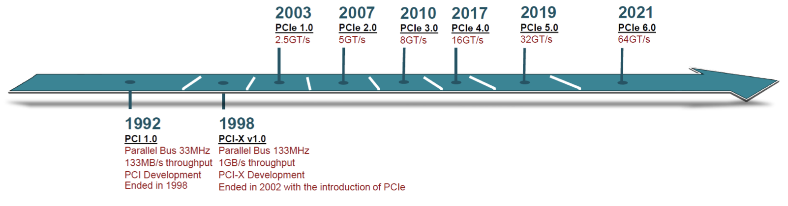 

=== icon:exchange[] PCIe bandwidth

[cols="1,1,1,1", options="header"]
|===
| PCIe Generation | Transfer Rate (GT/s) | Encoding | Effective Bandwidth per Lane

| PCIe 1.0
| 2.5
| 8b/10b
| ~250 MB/s

| PCIe 2.0
| 5.0
| 8b/10b
| ~500 MB/s

| PCIe 3.0
| 8.0
| 128b/130b
| ~985 MB/s

| PCIe 4.0
| 16.0
| 128b/130b
| ~1.97 GB/s

| PCIe 5.0
| 32.0
| 128b/130b
| ~3.94 GB/s

| PCIe 6.0
| 64.0
| PAM4 + FEC
| ~7.88 GB/s
|===


=== icon:microchip[] PCIe Topology & Components

As you can see in the picture (`Root Complex`) available `root ports` are nothing but `virtual PCI to PCI bridges`. These bridges will be connected to `bus 0` and these bridges will also create new busses to which other PCIe devices are connected.

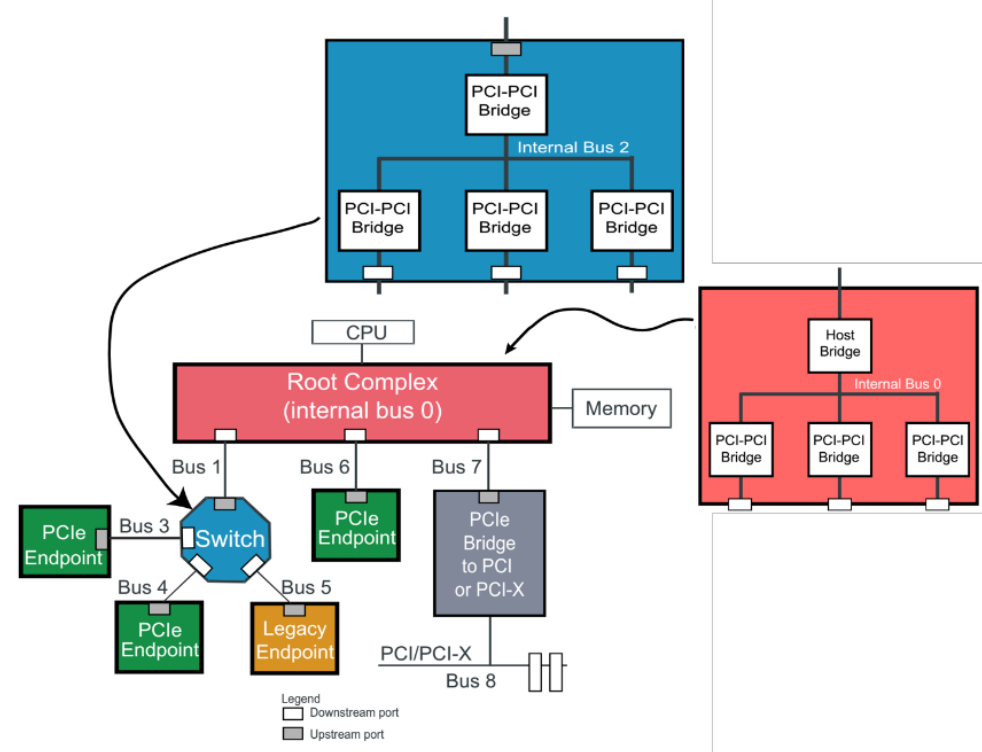

Given picture shows 3 root ports:

1. `Root Port 1` is connected to `PCIe to PCI-X bridge`.
2. `Root Port 2` is connected to `PCIe switch`.
3. `Root Port 3` is connected to `PCIe express endpoint`.

*Root Complex Insights*

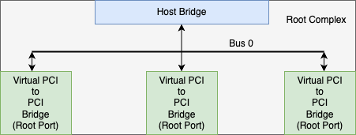

*PCIe Components*

[cols="1,3", options="header"]
|===
| Component | Description

| Root Complex
| The `Root Complex` is the PCIe controller present in the SoC. It connects the CPU and memory subsystem to the PCI Express fabric and manages communication with PCIe endpoint devices. It may support multiple Root Ports. In this example, the Root Complex supports **3 Root Ports**, each connecting to an endpoint device or a PCIe switch, forming a PCIe hierarchy.

| Host Bridge
| The `Host Bridge` connects the CPU to the PCI Express fabric. It acts as the interface between the processor and the PCIe subsystem.

| Root Port
| `Root ports` are nothing but `virtual PCI to PCI bridges`. A `Root Port` is a port on the Root Complex to which a PCIe Endpoint (a physical device such as NVMe or NIC) or a PCIe Switch (used to fan out multiple devices) can be connected.
Each Root Complex has a fixed number of Root Ports, which connect the CPU to different parts of the PCIe system.

| PCI-to-PCI Bridge
| `PCI-to-PCI Bridge` is used to create secondary PCI buses. The secondary bus is typically created via a `pci-bridge`.

|===

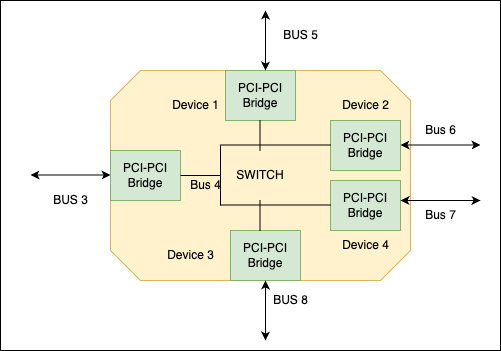

[cols="1,3", options="header"]
|===
| Component | Description

| PCI Express Switch
| `PCI Express Switch` is a device that routes packets to multiple ports and therefore multiple Endpoints at once.

| Endpoint(EP)
| `Endpoint(EP)` is a device that can be connected to a Root Port or Switch Port.

|===

This is how cpu rootcomplex and endpoint devices are communicate with each other.

* Endpoint device will be accessed by CPU via Root Complex.
* CPU receives the interrupts of all the endpoint devices via Root Complex, Interrupt section is covered later in the document
* Root Complex can also access the memory without use CPU like DMA.
* End point can access the Host memory directly using Root Complex. To access the memory host system makes end device bus master to give the permission to the endpoint device.
* PCIe uses point to point topology which means single serial link connect to PCIe device.
* Each bus also assigned with the bus number during the software configuration which help the ECAM to generate the bus address.
* These bus numbers are used by switches or bridges etc to do the packet transection.
* PCIe has its own address space, which can be 32-bit or 64-bit depending on the root complex.

[NOTE]
--
PCI address space is visible to the PCIe components like Root complex, endpoints, Switches and bridges etc.
--

=== icon:plug[] PCI Express PHY Layer

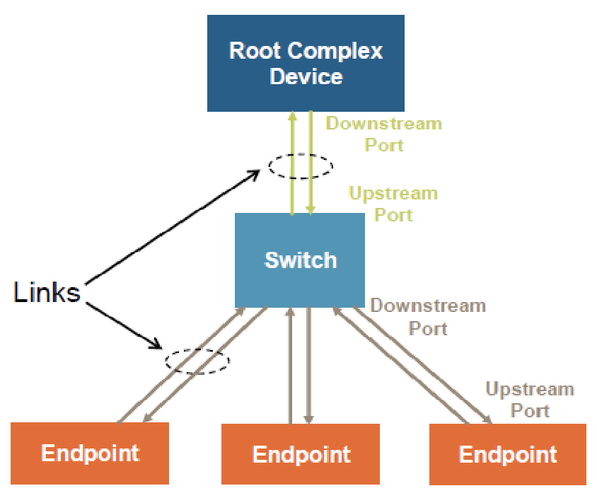

PCIe components connect via **Links** made of one or more **Lanes**, where each lane provides a full-duplex serial **Channel** between two **Ports**.

* **Link**: Collection of two ports and their interconnecting lanes.
* **Lane**: A set of differential signal pairs: one pair for Tx and another for Rx.
* **Port**:
** **Physically**: A group of transmitters and receivers located on the same chip that define a link.
** **Logically**: An interface between a component and a PCI Express Link.
* **x1, x2, x4, x8, x16, ..., xN (Link)**: A by-N link is composed of N lanes.

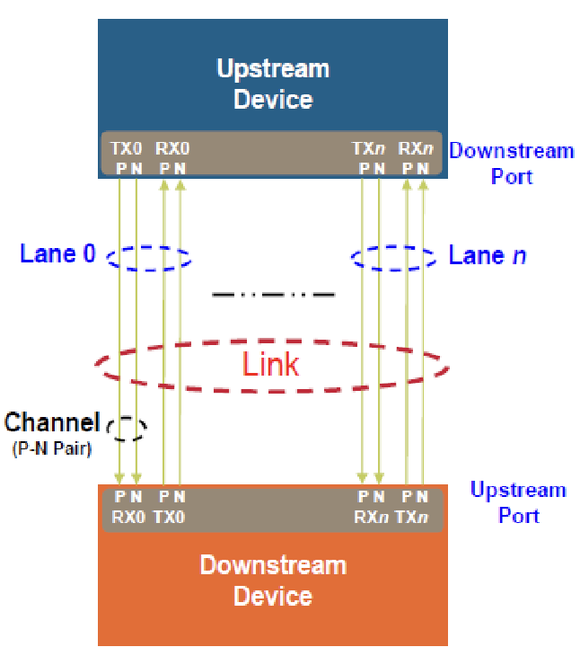

=== What changed from PCI to PCIe?

The biggest shift from legacy PCI to PCIe was how devices are connected and communicate.

* Legacy PCI used a shared bus.
* PCIe uses point-to-point links.

[cols="1,1,1", options="header"]
|===
| Feature | PCI (Legacy) | PCI Express (PCIe)

| Bus type
| Parallel, shared bus
| Serial, point-to-point links

| Topology
| Shared bus
| Switched fabric (Root Complex, Switches, Endpoints)

| Bandwidth
| Shared among all devices
| Dedicated per device / per link

| Duplex mode
| Half-duplex
| Full-duplex

| Scalability
| Limited (timing skew issues)
| Highly scalable (lanes x1, x4, x8, x16)

| Signaling
| Single-ended, parallel
| Differential, high-speed serial

| Clocking
| Separate clock line
| Embedded clock (clock data recovery)

| Protocol
| Simple load/store transactions
| Packet-based (TLPs)

| Interrupts
| INTx pins
| Message-based (MSI / MSI-X)

| Hot-plug support
| Limited
| Native support

| Typical bandwidth
| ~133 MB/s (33 MHz, 32-bit)
| GB/s per lane (generation dependent)
|===


[[legacy-pci]]
== Taking a Peek Inside Legacy PCI

In legacy PCI systems:

* All devices shared the same physical bus.
* Only one device could communicate at a time.
* Devices competed for bus ownership.
* Performance degraded as more devices were added.

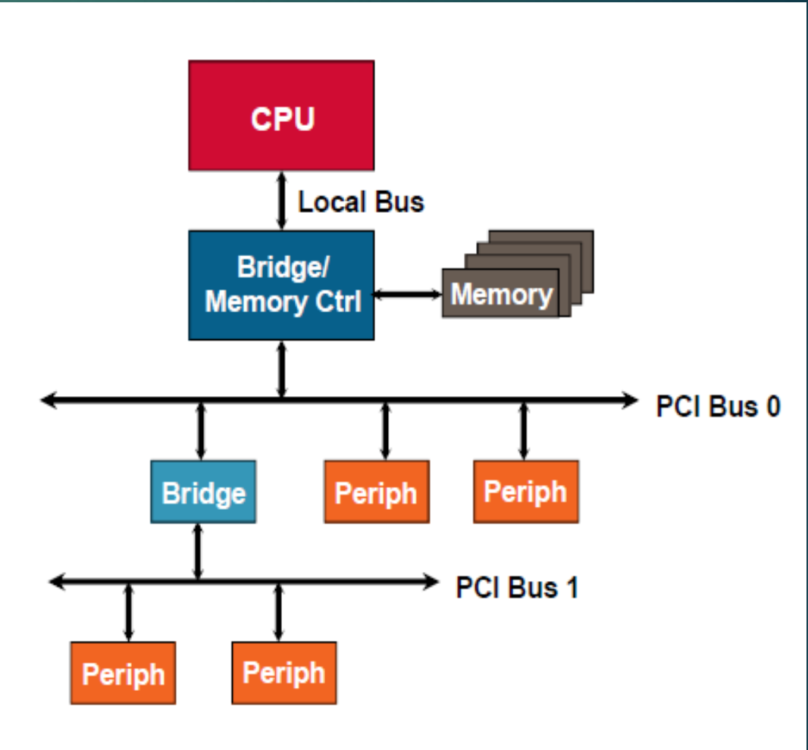

=== PCI Components

so when we are taking about PCIe we should also take about PCI bus device components:

* Host bridge
* PCI bridge
* PCI device

During this series we will be using qemu to explain the PCIe topology and also capturing the i.MX6 PCIe topology.

[[explore-the-pcie-hierarchy-using-lspci-output]]
== QEMU: Explore the PCIe Hierarchy using lspci output

Major change in PCIe from legacy PCI is the change from a true bus topology to a point-to-point link. We can take an example of network device to understand this(change from Hub to Switch). Each link is a  point to point link that is routed just like an Ethernet cord on a packet-switched Ethernet network. Instead of L3 packets, PCIe uses TLPs (Transaction Layer Protocol) to transfer data.
That means PCIe is not a bus protocol. here `bus` means multiple devices are talking on the same physical link. TLP packet are routed over the toplogy to find out the correct destination. we will uderstand this in details in next sections.

```bash
256 buses × 32 devices × 8 functions = 65,536 functions
```

```bash
root@playground-arm64:~# lspci -tv
-[0000:00]-+-00.0  Red Hat, Inc. QEMU PCIe Host bridge
           +-01.0  Red Hat, Inc. Virtio network device
           +-02.0  Red Hat, Inc. Virtio RNG
           +-03.0  Red Hat, Inc. Virtio block device
           +-04.0  Red Hat, Inc. QEMU XHCI Host Controller
           \-05.0  Red Hat, Inc. Device 10f1
```

* Each device connects through its own PCIe link.
* Links terminate at a Root Complex or a PCIe switch.
* Communication is packet-based.
* Multiple devices can transmit simultaneously without contention.

PCI devices are identified by a **Bus/Device/Function (BDF)** address. Busses are numbered 0–255, while Device and Function IDs specify the exact component.

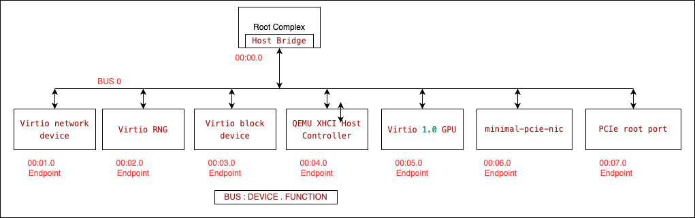

In the illustration above, we can see multiple `PCIe/PCI devices` and `root port` connected to the `Root Complex`. There can be mutiple `Root ports` which are physically supported by the `Root Complex`. 

This output illustrates the PCIe topology of the QEMU machine. The `QEMU PCIe Host bridge` (at `00.0`) represents the Root Complex, which is logically integrated into the CPU silicon and serves as the host interface for all PCIe communication. In the following sections, we will explore how to expand this topology by adding new devices.

Some root ports are connected to `PCIe switch` and some are connected to `PCIe endpoint` directly. We will cover this in **Exploring PCIe with QEMU**.

Bus 0 is physically integrated into the CPU silicon. Devices connected to this bus reside within the processor package and communicate via proprietary, high-speed internal interconnects. While these interconnects use vendor-specific protocols, they are logically presented to the system using the PCIe protocol. These specialized devices are known as **Root Complex Integrated Endpoints (RCIE)** because they are integrated directly into the Root Complex.

Below output is from the QEMU bu tit still shows the **Root Complex Integrated Endpoints (RCIE)**

```bash
00:04.0 USB controller: Red Hat, Inc. QEMU XHCI Host Controller (rev 01) (prog-if 30 [XHCI])
        Subsystem: Red Hat, Inc. Device 1100
        Control: I/O- Mem+ BusMaster+ SpecCycle- MemWINV- VGASnoop- ParErr- Stepping- SERR- FastB2B- DisINTx+
        Status: Cap+ 66MHz- UDF- FastB2B- ParErr- DEVSEL=fast >TAbort- <TAbort- <MAbort- >SERR- <PERR- INTx-
        Latency: 0, Cache Line Size: 64 bytes
        Interrupt: pin A routed to IRQ 29
        Region 0: Memory at 800000c000 (64-bit, non-prefetchable) [size=16K]
        Capabilities: [90] MSI-X: Enable+ Count=16 Masked-
                Vector table: BAR=0 offset=00003000
                PBA: BAR=0 offset=00003800
        Capabilities: [a0] Express (v2) Root Complex Integrated Endpoint, IntMsgNum 0. <<<<<< RCIE
                DevCap: MaxPayload 128 bytes, PhantFunc 0
                        ExtTag+ RBE+ FLReset- TEE-IO-
                DevCtl: CorrErr- NonFatalErr- FatalErr- UnsupReq-
                        RlxdOrd- ExtTag- PhantFunc- AuxPwr- NoSnoop-
                        MaxPayload 128 bytes, MaxReadReq 128 bytes
                DevSta: CorrErr- NonFatalErr- FatalErr- UnsupReq- AuxPwr- TransPend-
                DevCap2: Completion Timeout: Not Supported, TimeoutDis- NROPrPrP- LTR-
                         10BitTagComp- 10BitTagReq- OBFF Not Supported, ExtFmt+ EETLPPrefix+, MaxEETLPPrefixes 4
                         EmergencyPowerReduction Not Supported, EmergencyPowerReductionInit-
                         FRS-
                         AtomicOpsCap: 32bit- 64bit- 128bitCAS-
                DevCtl2: Completion Timeout: 50us to 50ms, TimeoutDis-
                         AtomicOpsCtl: ReqEn-
                         IDOReq- IDOCompl- LTR- EmergencyPowerReductionReq-
                         10BitTagReq- OBFF Disabled, EETLPPrefixBlk-
        Kernel driver in use: xhci_hcd
```

[[exploring-pcie-using-qemu]]
== Exploring PCIe using QEMU

There are two types of PCI Express Port: 

* The `Root Port` and the `Switch Port`.
* The `Root Port` originates a PCI Express link from a PCI Express Root Complex and the `Switch Port` connects PCI Express links to internal logical PCI buses.
* The `Switch Port`, which has its secondary bus representing the switch's internal routing logic, is called the switch's Upstream Port. The switch's Downstream Port is bridging from switch's internal routing bus to a bus representing the downstream PCI Express link from the `PCI Express Switch`.

We will cover both the usecases here:

1. Connect minimal-pcie-nic to pcie-root-port(pci bridge connected to bus 0).
2. Connect PCIe switch to pcie-root-port(pci bridge connected to bus 0) and then connect minimal-pcie-nic to downstream ports of switch.

these two senario will help us understand how PCIe topology is created in qemu ad we will be using it in further discussions.

Some of the key points to remember:

* QEMU does not have a clear socket-device matching mechanism and allows any PCI/PCI Express device to be plugged into any PCI/PCI Express slot.
* Avoid mixing hierarchies:
** PCI devices in PCIe slots may fail.
** PCIe devices in PCI slots lose access to the Extended Configuration Space.
* **Best Practice:** Connect PCIe devices only to PCIe Root Ports or Downstream Ports.

We need to understand the Root Bus (pcie.0) to understand how PCIe topology is created in qemu.

=== Root Bus (pcie.0)

These points are copied for kernel documentation as-is. I want to keep it here for reference.

Place only the following kinds of devices directly on the Root Complex:

    (1) PCI Devices (e.g. network card, graphics card, IDE controller),
        not controllers. Place only legacy PCI devices on
        the Root Complex. These will be considered Integrated Endpoints.
        Note: Integrated Endpoints are not hot-pluggable.

        Although the PCI Express spec does not forbid PCI Express devices as
        Integrated Endpoints, existing hardware mostly integrates legacy PCI
        devices with the Root Complex. Guest OSes are suspected to behave
        strangely when PCI Express devices are integrated
        with the Root Complex.

    (2) PCI Express Root Ports (pcie-root-port), for starting exclusively
        PCI Express hierarchies.

    (3) PCI Express to PCI Bridge (pcie-pci-bridge), for starting legacy PCI
        hierarchies.

    (4) Extra Root Complexes (pxb-pcie), if multiple PCI Express Root Buses
        are needed.

```bash
   pcie.0 bus
   ----------------------------------------------------------------------------
        |                |                    |                  |
   -----------   ------------------   -------------------   --------------
   | PCI Dev |   | PCIe Root Port |   | PCIe-PCI Bridge |   |  pxb-pcie  |
   -----------   ------------------   -------------------   --------------
```

[[connect-minimal-pcie-nic-to-pcie-root-port-pci-bridge-connected-to-bus-0]]
=== Connect minimal-pcie-nic to pcie-root-port(pci bridge connected to bus 0)

* Connect `minimal-pcie-nic` to `pcie-root-port`. Create root port at address `06.0` name it `rp2`.
Use rp2 to connect the `minimal-pcie-nic`.

```bash
# Command to create root port and connect minimal-pcie-nic to it
runqemu playground-arm64 nographic slirp \
        qemuparams="-m 512 \
        -machine virt \
        -device pcie-root-port,id=rp2,bus=pcie.0,chassis=2,addr=06.0 \
        -device minimal-pcie-nic,bus=rp2"
```

```bash
root@playground-arm64:~# lspci -tv
-[0000:00]-+-00.0  Red Hat, Inc. QEMU PCIe Host bridge
           +-01.0  Red Hat, Inc. Virtio network device
           +-02.0  Red Hat, Inc. Virtio RNG
           +-03.0  Red Hat, Inc. Virtio block device
           +-04.0  Red Hat, Inc. QEMU XHCI Host Controller
           +-05.0  Red Hat, Inc. Virtio 1.0 GPU
           \-06.0-[01]----00.0  Red Hat, Inc. Device 10f1

# visual representation of the PCIe hierarchy
Bus 00
 ├─ 00.0 Host Bridge
 ├─ 01.0 Virtio net
 ├─ 02.0 Virtio RNG
 ├─ 03.0 Virtio block
 ├─ 04.0 XHCI
 ├─ 05.0 Virtio GPU
 └─ 06.0 Root Port
       └─ Bus 01
           └─ 00.0 Device 10f1
```
    
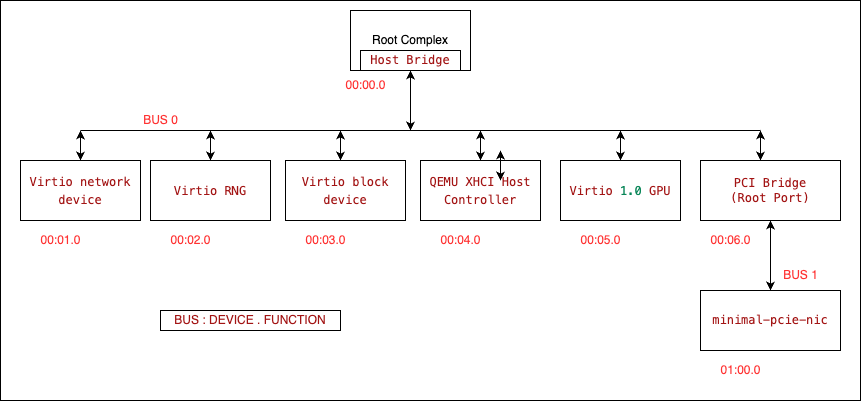

[[connect-pcie-switch-to-pcie-root-port-pci-bridge-connected-to-bus-0-and-then-connect-minimal-pcie-nic-to-downstream-ports-of-switch]]
=== Connect PCIe switch to pcie-root-port(pci bridge connected to bus 0)and then connect minimal-pcie-nic to downstream ports of switch

Here is the command to create `root port`, `upstream port` and `downstream ports` and connect minimal-pcie-nic to downstream ports of switch and connect upstream port to root port

```bash
runqemu playground-arm64 nographic slirp \
  qemuparams=" \
  -device pcie-root-port,id=rp2,bus=pcie.0,chassis=2,addr=0x6 \
  -device x3130-upstream,id=sw_up,bus=rp2 \
  -device xio3130-downstream,id=sw_dn1,bus=sw_up,chassis=3,addr=0x0 \
  -device xio3130-downstream,id=sw_dn2,bus=sw_up,chassis=4,addr=0x1 \
  -device minimal-pcie-nic,bus=sw_dn1 \
  -device minimal-pcie-nic,bus=sw_dn2"
```

```bash
root@playground-arm64:~# lspci -tv
-[0000:00]-+-00.0  Red Hat, Inc. QEMU PCIe Host bridge
           +-01.0  Red Hat, Inc. Virtio network device
           +-02.0  Red Hat, Inc. Virtio RNG
           +-03.0  Red Hat, Inc. Virtio block device
           +-04.0  Red Hat, Inc. QEMU XHCI Host Controller
           \-06.0-[01-04]----00.0-[02-04]--+-00.0-[03]----00.0  Red Hat, Inc. Device 10f1
                                           \-01.0-[04]----00.0  Red Hat, Inc. Device 10f1

# visual representation of the PCIe hierarchy
-[0000:00]-+-00.0  QEMU PCIe Host bridge
           +-01.0  Virtio network device
           +-02.0  Virtio RNG
           +-03.0  Virtio block device
           +-04.0  QEMU XHCI Host Controller
           \-06.0-[01-04]----00.0-[02-04]--+-00.0-[03]----00.0  Device 10f1
                                           \-01.0-[04]----00.0  Device 10f1
```

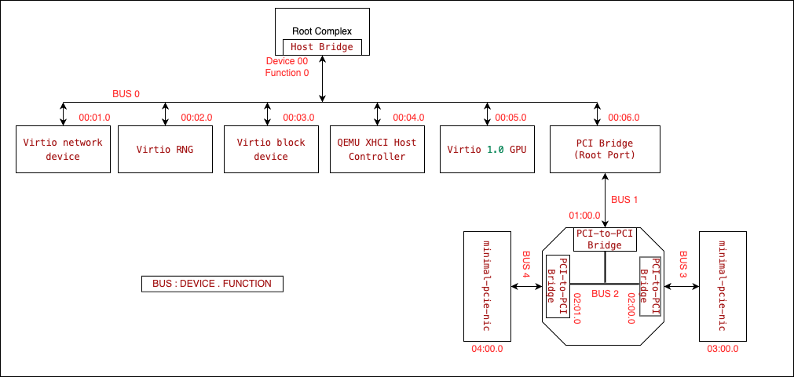

[IMPORTANT]
--
This is enough to get the idea about how bus device and functions are created in PCIe topology.
--

== Type 0 and Type 1 Configurations Space

`Endpoints` referred to as `Type 0` devices, and `Switch` (or a `Bridge`) referred to as `Type 1` devices.

* Type 1 headers for Root Complex, switches, and bridges.

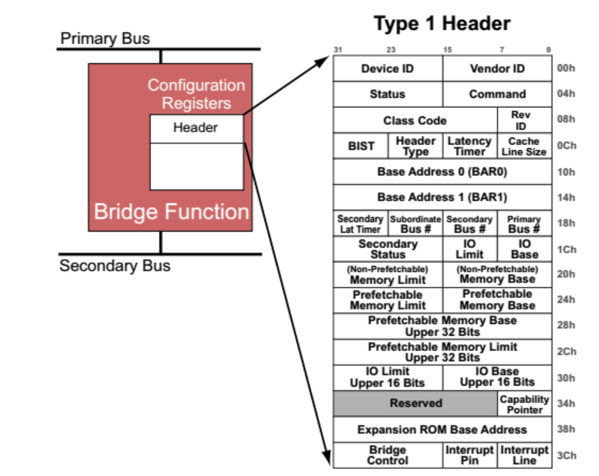

* Type 0 for endpoints.

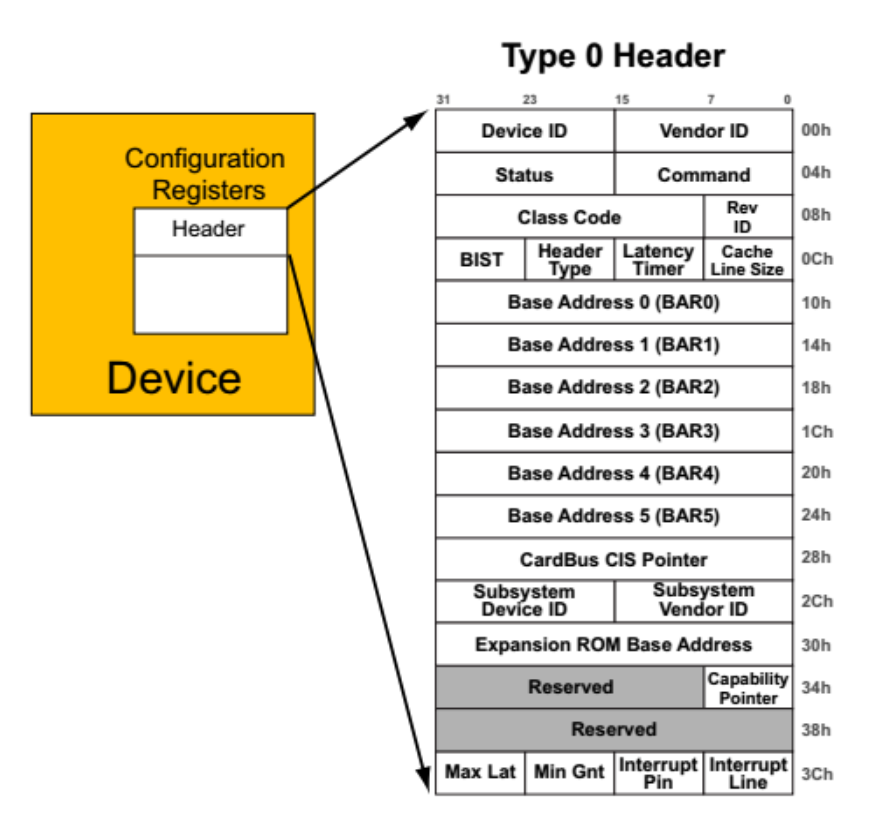

* There are two ways to access the configuration space.
** *PCI-Compatible Configuration Access:* PCI-Compatible configuration method can only access 256byte (PCI
standard) .Using Configuration Address Port 0xCF8h and data port 0xCFCh

** *PCIE-Compatible Configuration Access:* PCIe-Compatible Configuration Method uses ECAM address. Using this
method user can access 4KB of Configuration space.

== ECAM QEMU Example
We are taking an example here to understand the **ECAM**

```lspic
root@playground-arm64:~# lspci -tv
-[0000:00]-+-00.0  Red Hat, Inc. QEMU PCIe Host bridge
           +-01.0  Red Hat, Inc. Virtio network device
           +-02.0  Red Hat, Inc. Virtio RNG
           +-03.0  Red Hat, Inc. Virtio block device
           +-04.0  Red Hat, Inc. QEMU XHCI Host Controller
           \-06.0-[01-04]----00.0-[02-04]--+-00.0-[03]----00.0  Red Hat, Inc. Device 10f1
                                           \-01.0-[04]----00.0  Red Hat, Inc. Device 10f1
```

* Check the `ECAM address` from `/proc/iomem`

```bash
root@playground-arm64:~# cat /proc/iomem |grep ECAM
4010000000-401fffffff : PCI ECAM
root@playground-arm64:~#
```

* Now let say we want to read the vendor id of `04:00.0  Red Hat, Inc. Device 10f`. This requires some calculations.

```bash
| 27 - 20 | 19 - 15 | 14 - 12     |  11 - 0       |
| Bus Nr  | Dev Nr  | Function Nr | Register      |
```

Formula to calculate the address:

```bash
>>> hex(ECAM Address + ((bus << 20) | (dev << 15) | (func << 12)))
```

```bash
Python 3.10.12 (main, Jan  8 2026, 06:52:19) [GCC 11.4.0] on linux
Type "help", "copyright", "credits" or "license" for more information.
>>> hex(0x4010000000 + ((4 << 20) | (0 << 15) | (0 << 12)))
'0x4010400000'
>>>
```

* Read and compare the vendor id

```bash
root@playground-arm64:~# devmem2 0x4010400000
/dev/mem opened.
Memory mapped at address 0xffff9ee0d000.
Read at address  0x4010400000 (0xffff9ee0d000): 0x10F11AF4
root@playground-arm64:~# lspci -s 04:00.0 -x
04:00.0 Ethernet controller: Red Hat, Inc. Device 10f1 (rev 01)
00: f4 1a f1 10 06 04 10 00 01 00 00 02 00 00 00 00
10: 00 00 20 10 00 10 20 10 00 00 00 00 00 00 00 00
20: 00 00 00 00 00 00 00 00 00 00 00 00 f4 1a 00 11
30: 00 00 00 00 98 00 00 00 00 00 00 00 00 00 00 00

root@playground-arm64:~#
```

== ECAM i.MX6 Example

* First we should know about the Memory map of i.MX6. This info can be easily derived from the device tree.

```bash
DBI             : start addr = 0x01ffc000 - end addr = 0x1ffffff - size = 0x4000 (16KB)
Config Space    : start addr = 0x01f00000 - end addr = 0x1f7ffff - size = 0x80000 (512KB) <<<<
Downstream IO   : start addr = 0x01f80000 - end addr = 0x1f8ffff - size = 0x00010000 (64KB)
NP memory       : start addr = 0x01000000 - end addr = 0x1efffff - size = 0x00f00000 (15MB)
```

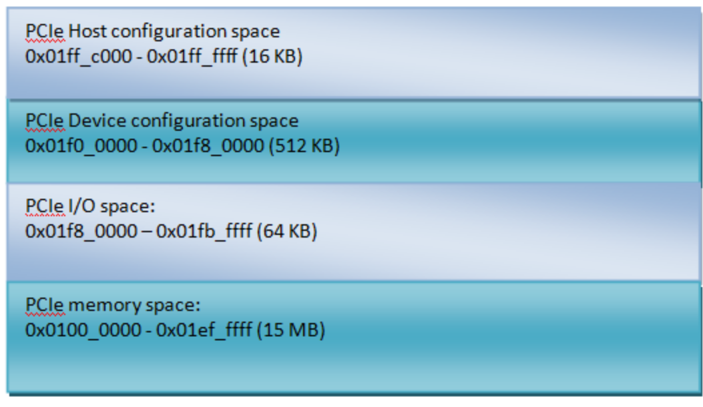

IO and memory spaces are two address spaces used by the devices to communicate
with their device driver running in the Linux kernel on CPU.

* The upper 16 KB PCIe host configuration space.
* This memory segment is used to map the configuration space of PCIe RC. SW
can access PCIe RC core configuration space through the DBI interface.
* PCIe device configuration space.
* Used to map the configuration spaces of PCIe EP devices that are inserted to the
RC downstream port.

* lspci dump

```bash
root@imx6:~# lspci -vv
00:00.0 PCI bridge: Synopsys, Inc. DWC_usb3 / PCIe bridge (rev 01) (prog-if 00 [Normal decode])
01:00.0 Network controller: Intel Corporation Wi-Fi 6 AX210/AX211/AX411 160MHz (rev 1a)
root@imx6:~#
```

* PCIe ECAM maps configuration space in the following way:

```bash
Device: 01:00.0 → Bus 1, Device 0, Function 0
```

```bash
# imx6dl Manual: ECAM Scheme from PCIe Specification using an 8-bit BDF Bus Number
>>> bus, dev, func, ext_reg, reg = 1, 0, 0, 0, 0
>>> ecam_offset = hex((bus << 24) + (dev << 19) + (func << 16) + (ext_reg << 8) + (reg << 2))
>>> print(ecam_offset)
0x1000000
>>>
```

* In i.MX6, ECAM space starts at `0x01f00000` and it maps all the endpoint device configuration space.

----
ECAM cpu address -> translate to -> pci address + ecam_offset

0x01f00000 -> 0x1000000
----

* Lets try to read the `0x1f00000`. We should get vendor and device id of EP `01:00.0`
----
$ devmem2 0x1f00000
 0x002B168C

$ root@imx6dl:~# lspci -s 01:00.0 -x
01:00.0 Network controller: Qualcomm Atheros AR9285 Wireless Network Adapter (PCI-Express) (rev 01)
00: 8c 16 2b 00 ....
----

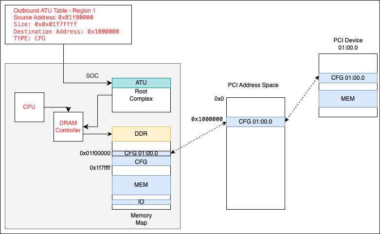

This section explains the address space used by PCI transections.

* Left is the SOC which has the root complex IP.
* Right we have PCIe express endpoint.
* Host system can access the PCIe endpoint only using this PCIe address space. This PCIe address space is a virtual address space which is used by PCIe devices.
* PCIE address space is just a list of address used in the transection layer packet in order to identify the target of the transection.
* IP Registers: registers to enable the clock, program the PHY, configure lane width, configure the speed, registers to program the address translation unit.

[NOTE]
ATUs are programmed to convert the CPU address to PCI address.`0x01f00000` mapped to `0x1000000` using Outbound ATU configuration.

**Lets briefly cover the ATUs**

ATUs are programmed to convert the CPU address to PCI address. CPU address is the location on the physical memory map and PCI address is the address which Root Comples uses to generate the TLP to access the configuration space.

* Here is i.MX6 ATU configuration

```bash
# Output from dmesg
[    7.399922] ATU[1] OUTBOUND:
[    7.402807]   CPU addr : 0x01f00000 - 0x01f7ffff (size 0x80000)
[    7.408729]   PCI addr : 0x0000000001000000
[    7.412913]   TYPE: 0x4 FUNC: 0

# Register dump
# ATU Region Lower Base Address Register
root@imx6dl:~# devmem2 0x1ffc900 w 0x00000001 << region 1
root@imx6dl:~# devmem2 0x1ffc904
0x00000004
root@imx6dl:~# devmem2 0x1ffc908
0x80000000
root@imx6dl:~# devmem2 0x1ffc90C
 0x01F00000
root@imx6dl:~# devmem2 0x1ffc910
 0x00000000
root@imx6dl:~# devmem2 0x1ffc914
 0x01F7FFFF
root@imx6dl:~# devmem2 0x1ffc918
 0x01000000
root@imx6dl:~# devmem2 0x1ffc91c
 0x00000000
root@imx6dl:~#
```

*Refer i.MX6dl reference manual for register details**

== Understand PCIe from memory point of view

It s not easy to create a picture in mind that what is happening when we iniate Configurations read or write request and Memory read or write request.I am trying to write it in a way that it will be easy to understand.

We will create a mapping of following.

* CPU Address Space: This is the physical address space of the CPU(which CPU understands) and create virtual memory mapping when accessing it from Driver(kernel space).
* PCIe Address Space: This is the virtual address space used by PCIe devices. This space if only understood by Root Complex and PCIe Device.
* RAM: This is the physical memory space.
* MMIO: This is the memory mapped I/O space.

A typical system maps virtual memory to physical memory across distinct regions for RAM and PCI devices. Due to the 32-bit addressing limitations of older PCI devices, memory is often split:

* **32-bit Windows (Below 4GB):** A constrained space for legacy devices. RAM or PCI resources are moved above 4GB if they exceed this window.
* **64-bit Windows (Above 4GB):** A second window for modern devices that support 64-bit addressing. 

Since modern processors support 64-bit addresses, they can access both regions seamlessly. It is generally preferred to move as much device memory as possible above the 4GB line to avoid cluttering the limited 32-bit address space.

This is the high level picture:

When the CPU performs a read or write operation to an address within the PCI memory region, the Root Complex automatically generates a Transaction Layer Packet (TLP) and transmits it to the PCIe device.

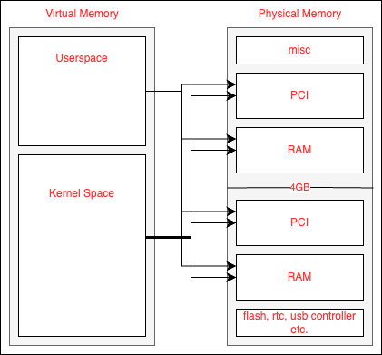

Here is the example from QEMU:

```bash
root@playground-arm64:~# cat /proc/iomem |grep pci
10000000-3efeffff : pcie@10000000
    10043000-10043fff : minimal_pcie_nic_drv
    10044000-10044fff : minimal_pcie_nic_drv
8000000000-ffffffffff : pcie@10000000
    8000000000-8000003fff : virtio-pci-modern
    8000004000-8000007fff : virtio-pci-modern
    8000008000-800000bfff : virtio-pci-modern
    8000010000-8000013fff : virtio-pci-modern
root@playground-arm64:~#
```

=== Read PCIe configuration space register

Let’s travers the read config path from root complex to pcie device.

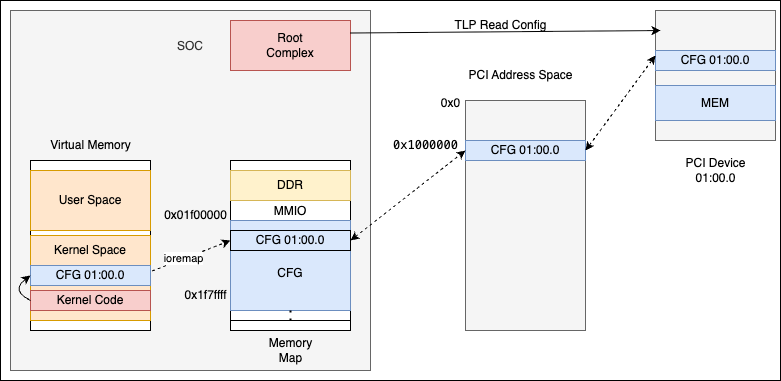

1. Some code (Let say PCIe NIC driver) wants to read the Vendor ID register of the PCIe device. Drive can either use predefined pcie_config_read32() or pcie_config_read16() or pcie_config_read8() function or it can directly access the ECAM virtual mapping. By creating a virtual mapping of ECAM space.
2. When driver initate the read. it ti traslated to physical ecam address.
3. Read on this address casues the root complex to generate a configuration TLP and send it through the hierarchy.
4. TLP packet looks like this. This packet we captured using PCIe trace.

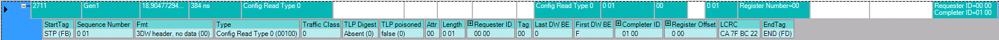

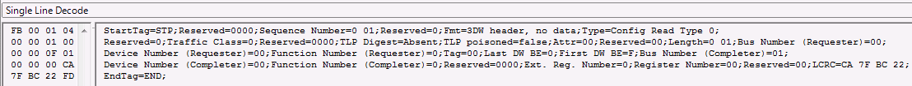

[NOTE]
Format of TLP packet is explained later. For now we check that Requested ID is `00 00` which means it is coming from Root Complex and Completer ID is `01 00` which means it is going to Bus 1 Device 0 Function 0. Register Offset is `0x00` which means it is going to Vendor ID register.

5.The TLP is received by endpoint on Bus 1 and sees that it is a configuration space TLP. It now knows to respond with a configuration space response TLP that contains the contents of the value at offset 0x0.

=== Respose of Config Read

The device responds with a special TLP containing the value at offset 0 (which we know is the Vendor ID). That packet makes its way back to the Requester (which was the Root Complex) and the interconnect informs the CPU to update the value to the value of 0x8680 which is the vendor ID of the Intel wifi card. Below if the response TLP.

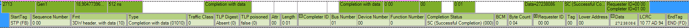

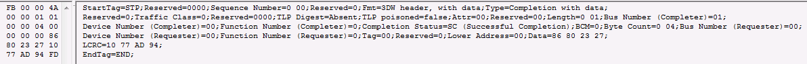

== Data Transfer in PCIe

`Configuration space` serves as the primary mechanism for device communication via BDF during the enumeration process(LTSSM). This simplified transfer mode is essential for establishing the parameters required for all subsequent data transfer methods(link, lane, MSS, etc). Following enumeration, the configuration space contains the settings necessary for the device to perform its intended tasks alongside the host. Although it continues to be used for monitoring device status and link state, it is not utilized for high-speed data throughput or primary device operations.

Lets talk about data transfer which is actualy using `high speed` PCIe capabilities or implementation.

**What is BAR?**

We have already used this term in above sections. Lets dig more deeper and understand what is BAR and how Rootcomplex is using it to map the memory space of a PCIe device to the memory space of the CPU(MMIO).

`Base Address Register (BAR)` is a 32-bit or 64-bit register that is used to map the memory space of a PCIe device to the memory space of the CPU.

=== Steps to map the endpoint device memory space to the CPU memory space

Memory space cannot be accessed in the same way as configuration space because the size of the memory space varies between devices. Therefore, the host system must first determine the size of the memory space required by the endpoint.

* To determine the size, the host system uses the **Base Address Registers (BARs)** located in the configuration space header.
* BARs can be utilized for both Memory and I/O space mapping.
* **Bit 0:** Indicates whether the endpoint requires `Memory space` (0) or `I/O space` (1).
* **Bits 1-2:** Describe if the PCIe endpoint supports `32-bit address decoding` or `64-bit address decoding`.
* **Bit 3:** Indicates whether the memory space is `prefetchable` or `non-prefetchable`.

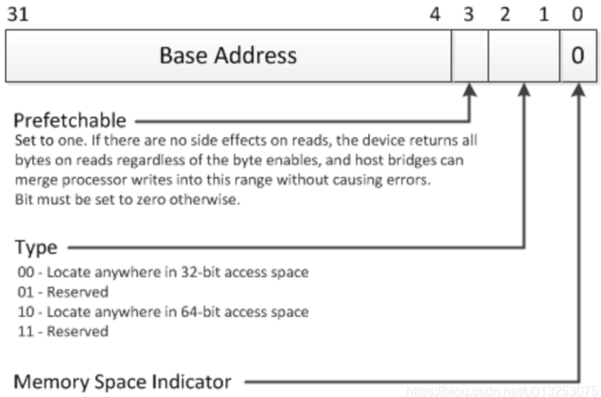

**How to get the Size requested by Endpoint ?**

To determine the size of the memory space, the host system follows these steps:

. **Write all 1's** to the BAR register.
. **Read back** the BAR register. The endpoint will respond with a value where the lower bits (which are read-only) remain unchanged.
. **Clear the last 4 bits** (control bits).
. **Invert** the bits.
. **Add 1**.

*Example:*

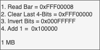

In the given example, the endpoint has requested a memory space of 1MB.

* Once the host system gets the size of the memory space, it will allocate the same size of memory in the configurable address space (in the dedicated memory space region).
* This will then be used to access the memory of the PCIe express endpoint.
* The system will allocate 1MB of memory in the dedicated memory space given for the Root Complex.

**ATMU configuration for Memory transection**

As per the given figure, we program the source address (for example, 'C' in the PCIe Memory space) to address 'C' in the PCIe address space.

* The source address is "C", the destination address is "C", and the size is 256MB as we are translating the complete address space. The type is MEM.
* Since we are mapping the entire Memory Space available for the Root Complex to the PCIe address space with type as MEM, we avoid performing address translation for each individual device.
* Whenever the CPU accesses this particular region in the configurable address space, the Root Complex will access this region in the PCIe address space based on the ATMU.
* Currently, the PCIe endpoint will not respond to the memory transaction because the PCIe address space is not yet mapped to the endpoint BARs.
* We will program the BAR registers with the PCIe address space to which the memory is mapped.
* In the Endpoint configuration space, address "X" is programmed to map the endpoint memory to the PCIe address space.

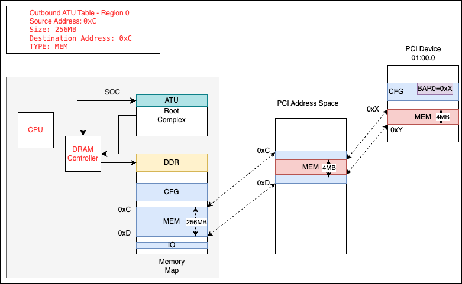

Use iMX6 meory map to understand this better.

* From device tree

```bash
reg = <0x01ffc000 0x04000>,<0x01f00000 0x80000>;
reg-names = "dbi", "config";
ranges = <0x81000000 0 0 0x01f80000 0 0x00010000 /* downstream I/O */ -> 64KB
0x82000000 0 0x01000000 0x01000000 0 0x00f00000>; /* non-prefetchable memory */ -> 15MB

DBI             : start addr = 0x01ffc000 - end addr = 0x1ffffff - size = 0x4000 (16KB)
Config Space    : start addr = 0x01f00000 - end addr = 0x1f7ffff - size = 0x80000 (512KB)
Downstream IO   : start addr = 0x01f80000 - end addr = 0x1f8ffff - size = 0x00010000 (64KB)
NP memory       : start addr = 0x01000000 - end addr = 0x1efffff - size = 0x00f00000 (15MB)
```

* Here is the mapping of entire memory space(CPU address space to PCIe address space)

```bash
[    1.182170] ATU[0] OUTBOUND:
[    1.207125]   CPU addr : 0x01000000 - 0x01efffff (size 0xf00000)
[    1.213143]   PCI addr : 0x0000000001000000
[    1.217342]   TYPE: 0x0 FUNC: 0

root@imx6dl:~# devmem2 0x1ffc900 w 0x00000000 << region 0
root@imx6dl:~# devmem2 0x1ffc90C
0x01000000
root@imx6dl:~# devmem2 0x1ffc904
0x00000000
root@imx6dl:~# devmem2 0x1ffc908
0x80000000
root@imx6dl:~# devmem2 0x1ffc90c
0x01000000
root@imx6dl:~# devmem2 0x1ffc910
0x00000000
root@imx6dl:~# devmem2 0x1ffc914
0x01EFFFFF
root@imx6dl:~# devmem2 0x1ffc918
0x01000000
root@imx6dl:~# devmem2 0x1ffc91c
0x00000000
root@imx6dl:~#
```

* This is how memory is assigned to PCIe device.

```bash
01000000-01efffff : pcie@1ffc000
  01000000-010fffff : 0000:00:00.0
  01100000-011fffff : PCI Bus 0000:01
    01100000-0110ffff : 0000:01:00.0
      01100000-0110ffff : ath9k
  01200000-0120ffff : 0000:00:00.0
01ffc000-01ffffff : 1ffc000.pcie dbi

00:00.0 PCI bridge: Synopsys :Region 0: Memory at 01000000 (32-bit, non-prefetchable) [virtual] [size=1M]
01:00.0 Network controller: Qualcomm Atheros AR9285 :Region 0: Memory at 01100000 (64-bit, non-prefetchable) [virtual] [size=64K]
```

== PCIe IO Lines

* Less number of IO lines compare to PCI.
* Uses pair of differential RX lines and pair of differential TX lines.
* Given figure shows two lane card design as it shows two pair of differential RX lines and two pair of differential RX lines.
* PRESET# tells when the voltage and clock signals are stable.
* PRSNT1# and PRSNT2# used for hot plug.
* PCIe doesn't uses dedicated IRQ lines unlike PCI which has 4 IRQ lines.
* PCIe uses in band signalling even for interrupt and it will be all transmitted using this differential TX and RX lines.

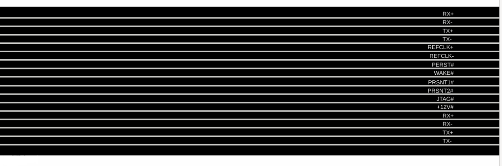


* `TBD`

[[references]]
== References

* https://www.ti.com/lit/an/snla415/snla415.pdf?ts=1767492313842
* https://blogs.oracle.com/linux/a-study-of-the-linux-kernel-pci-subsystem-with-qemu
* https://github.com/qemu/qemu/blob/master/docs/pcie.txt
* https://www.kernel.org/doc/Documentation/PCI/PCIEBUS-HOWTO.txt
* https://ctf.re/windows/kernel/pcie/tutorial/2023/02/14/pcie-part-1/